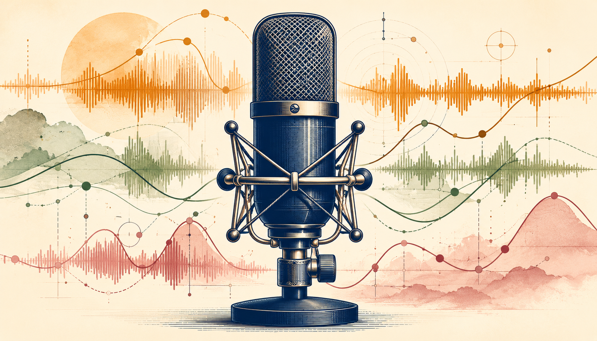

# speech-habit-lens



> 1分間スピーチの癖を、AmiVoice ESAS（感情20パラメータ）× Claude の三層解析で可視化する CLI + Streamlit UI

**Status:** v0.2（Zennfes Spring 2026 提出版）｜ **License:** MIT

---

## 何が見えるか

1分のスピーチを `.wav` で投げると、こういう **音響 × 言葉** の連動が見えます:

> **「開幕の anticipation=65 × energy=2 — 空振りの助走」**
> 頭の中では強く踏み出そうとしているが、声として身体から出てこない状態が冒頭を支配し、第一印象が薄い

> **「intensive_thinking=62 × energy=3 — 考えるほど声が消える」**
> 最も激しく考えている瞬間に声の出力とパッションが最低になる逆相関

> **「passionate=0 多発 × フィラーゼロ — 流暢だが熱量無し」**
> 言葉は止まらないが情動信号は0、つまり「止まれないから出続ける言葉」になっている

これは Stallman の60秒スピーチ（CC BY-ND）を実際に解析した出力の抜粋です。テキスト認識が誤認識まみれでも、ESAS は言語非依存で機能するので **音響的な癖は鋭く出る** のがこのツールの面白いところ。

## 三層解析

| 層 | 入力 | 抽出する癖 |
|---|---|---|
| **音響層** | ESAS 20 パラメータ時系列 | テンション推移、抑揚の偏り、出だしのエネルギー、終端の失速 |
| **テキスト層** | 認識テキスト + セグメント | フィラー、結論位置、繰り返し語、論理展開 |
| **クロス層 ⭐** | 上記2層の出力 + 元データ | 「結論手前で声量が落ちる」等の身体×言語連動（**ここが差別化**） |

すべて Grounding Rule（時刻 + パラメータ + 引用 の3点引用必須）でハルシネーション抑制。

---

## インストール

```bash
git clone https://github.com/kenimo49/speech-habit-lens
cd speech-habit-lens

# venv 推奨
python3 -m venv .venv
source .venv/bin/activate
pip install -e .

# API key 設定
cp .env.example .env
# AMIVOICE_API_KEY と ANTHROPIC_API_KEY を記入
```

必要なもの:

- Python 3.10 以上
- ffmpeg（サンプル取得用、`tools/fetch_speech.sh` で使用）
- [AmiVoice API key](https://acp.amivoice.com/) — 月60分まで無料、[詳細な取得手順](docs/setup/amivoice-api-key.md)
- [Anthropic API key](https://console.anthropic.com/) — Claude Sonnet 4.6 で1解析あたり約 ¥18

> **Zennfes 2026 春の参加者向け:** クーポンコード `Na5bkyRHoi` を AmiVoice マイページで適用すると、月10時間まで無料枠が拡大します（[詳細](docs/setup/amivoice-api-key.md#zennfes-2026-春--trial-クーポン2026年5月6月限定)）。

---

## クイックスタート

### CLI

```bash
# サンプル音声を取得（CC BY-ND の Stallman 講演を60秒切り出し）
./tools/fetch_speech.sh \
  "https://archive.org/download/180th-nexa-wednesday/180th-Nexa-Wednesday.mp4" \
  examples/sample.wav 30 60

# 解析（recognize → ESAS → Claude × 3 layers → Markdown）
shl analyze examples/sample.wav --out report.md

# 詳細ログ付き
shl analyze examples/sample.wav --out report.md --verbose

# モデル指定
shl analyze examples/sample.wav --model claude-opus-4-7 --out report.md
```

### Streamlit UI

```bash
shl serve
# → http://localhost:8501 をブラウザで開く
```

- **「🎙 録音する」タブ**: ブラウザのマイクから直接録音（`st.audio_input`）、停止後に自動で AmiVoice 仕様（16kHz / mono / 16-bit PCM）に変換
- **「📁 ファイルをアップロード」タブ**: 既存のWAVをドラッグ&ドロップ
- ESAS 時系列を Plotly でインタラクティブ表示（パラメータの追加/削除可）
- クロス層パターンを expandable カードで確認
- Markdown レポートをダウンロード

API key はサーバ側で `.env` から読み込まれるため、ブラウザには露出しません。

---

## サンプル出力

```markdown
## クロス層 ⭐

### 1. 開幕・高anticipation×低energy：身体が出てこない助走状態

- **証拠**: 0.0s, `anticipation=65, energy=2, confidence=15`,
  「（スピーチ冒頭セグメント）」
- **意味**: スピーチ開始直後に先取り感が最大化しているにもかかわらず、
  声のエネルギーは最低水準。頭の中で踏み出そうとしているが声として
  出てこない助走状態が開幕を支配している。

## 改善提案

1. 冒頭5秒で意図的に声量を一段上げるアンカー動作を設計する
   - 根拠: 開幕・高anticipation×低energy：身体が出てこない助走状態
```

完全版は `/tmp/report.md`（`shl analyze` 実行後）または Streamlit UI で確認できます。

---

## ESAS 20 パラメータ

`docs/knowledge/amivoice-esas.md` 参照。実フィールド名は AmiVoice 公式 doc には 5 例しか記載がありませんが、本ツールで 20 全件を実測確認済み:

```
energy, content, upset, aggression, stress, uncertainty,
excitement, concentration, emo_cog, hesitation, brain_power,
embarrassment, intensive_thinking, imagination_activity,
extreme_emotion, passionate, atmosphere, anticipation,
dissatisfaction, confidence
```

値域はパラメータごとに異なる整数で（公式 [`/v1/sentiment-analysis/ja/result-parameters.json`](https://docs.amivoice.com/en/amivoice-api/manual/reference-list-sentiment-analysis-parameters/) 確認、`emo_cog` は 1-500、`atmosphere` は -100~100、`energy / stress / concentration / anticipation / intensive_thinking / brain_power` は 0-100、残り 12 個は 0-30）、約 2 秒間隔でサンプリングされます。

---

## プロジェクト構造

```
speech-habit-lens/
├── src/speech_habit_lens/
│   ├── recognize.py      # AmiVoice 非同期 HTTP ラッパー
│   ├── esas.py           # ESAS 時系列パース
│   ├── analyze.py        # Claude × 3 layers 解析
│   ├── report.py         # Markdown レポート生成
│   ├── cli.py            # shl コマンド
│   └── webui.py          # Streamlit UI
├── prompts/
│   ├── acoustic_layer.md # 音響層プロンプト
│   ├── text_layer.md     # テキスト層プロンプト
│   ├── cross_layer.md    # クロス層プロンプト ⭐
│   └── _version.md       # プロンプト履歴
├── tools/
│   └── fetch_speech.sh   # license-clean な音声取得
├── examples/
│   └── CREDITS.md        # サンプル音声の出典・ライセンス
├── docs/
│   ├── design.md         # アーキテクチャ設計書
│   ├── setup/            # API key 取得ガイド
│   └── knowledge/        # AmiVoice 仕様ナレッジベース
└── tests/
```

---

## ケーススタディ

- [**4本の名スピーチを1分ずつ解析した比較**](docs/case-studies/4-pitches-comparison.md) — Steve Jobs / 孫正義 / 西野亮廣 / 落合陽一 を ESAS × Claude で比較。結論位置・フィラー・身体と言葉のラグなど、人によって違うクセが定量化される

## 関連ドキュメント

- [アーキテクチャ設計書](docs/design.md) — 全モジュールの責務・データ構造・エラー処理
- [AmiVoice API key 取得ガイド](docs/setup/amivoice-api-key.md) — Zennfes クーポン適用含む
- [AmiVoice ナレッジベース](docs/knowledge/README.md) — overview / API reference / ESAS 詳細
- [サンプル音声の出典](examples/CREDITS.md) — license-clean なソースから取得する手順

---

## 既知の制限

- **長さ**: 30〜90秒を推奨。120秒超は拒否、60秒超は警告（AmiVoice 月60分無料枠の保護）
- **フォーマット**: 16kHz / mono / 16-bit PCM WAV を推奨（他フォーマットは `tools/fetch_speech.sh` で変換可）
- **言語**: 認識は AmiVoice のエンジン依存（デフォルト `-a-general` は日本語）。ESAS は言語非依存
- **解析時間**: AmiVoice polling 約90秒 + Claude × 3 layers 約2分 = 1解析あたり3-4分

---

## ライセンス

MIT License。

サンプル音声は各自のローカル取得とし、本リポジトリには同梱しません（多くの音源が CC BY-ND 等で、抽出した一部分の再配布が曖昧なため）。詳細は [examples/CREDITS.md](examples/CREDITS.md) 参照。

## Acknowledgements

- [AmiVoice Cloud Platform](https://acp.amivoice.com/) — 音声認識 + ESAS 感情分析 API
- [Anthropic Claude](https://www.anthropic.com/claude) — 三層解析 LLM
- Zennfes 2026 Spring 主催（株式会社アドバンスト・メディア）— 月10時間無料 Trial クーポン提供
