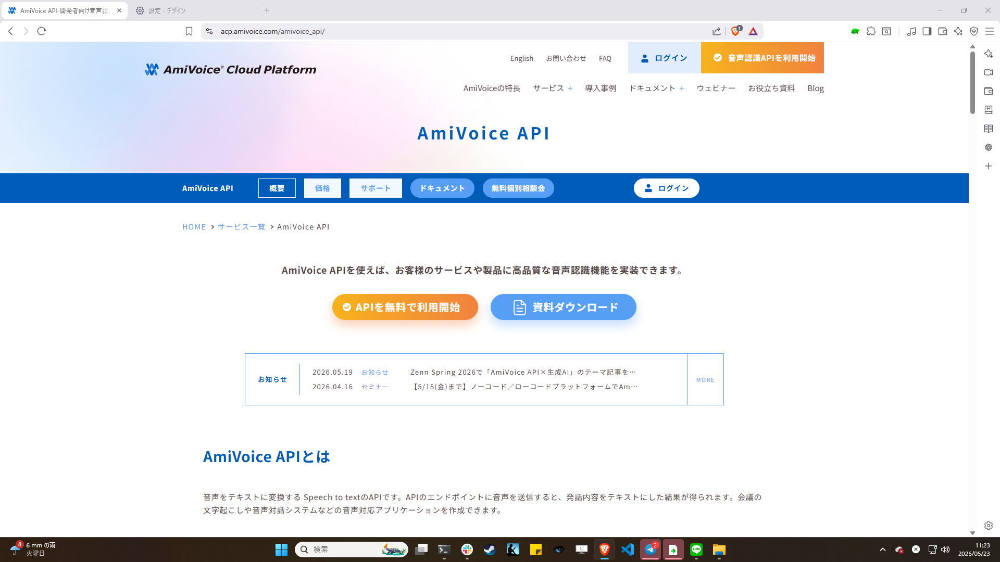
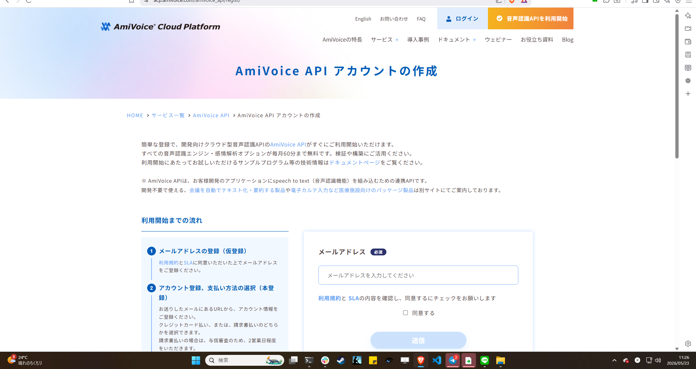
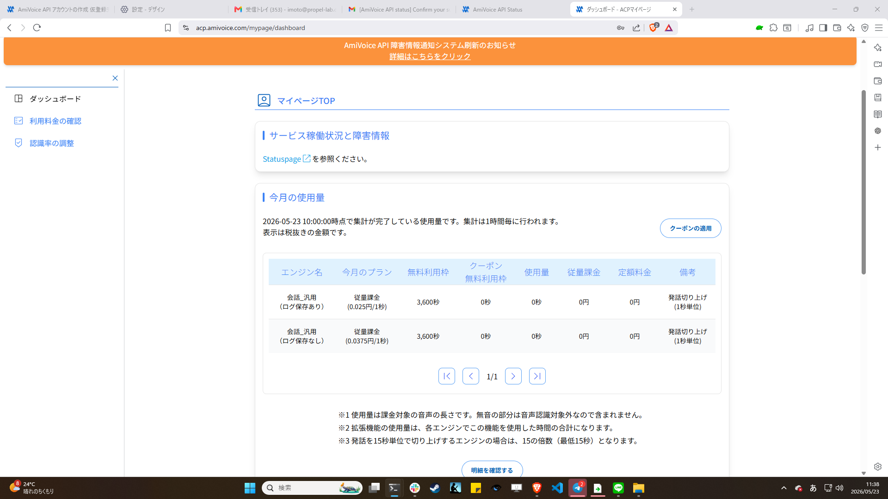
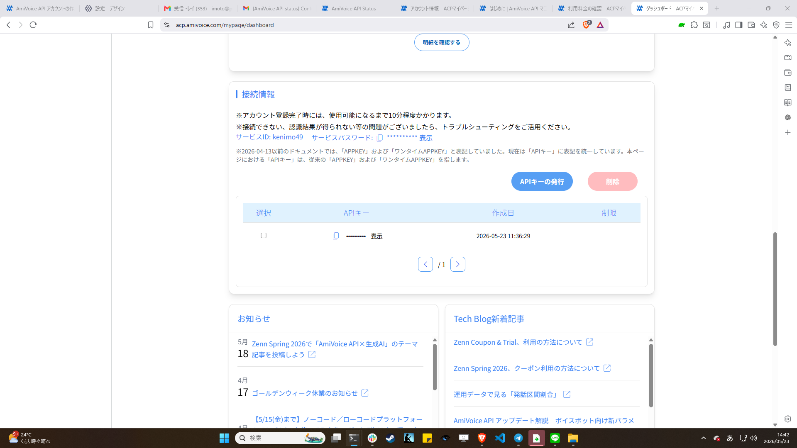
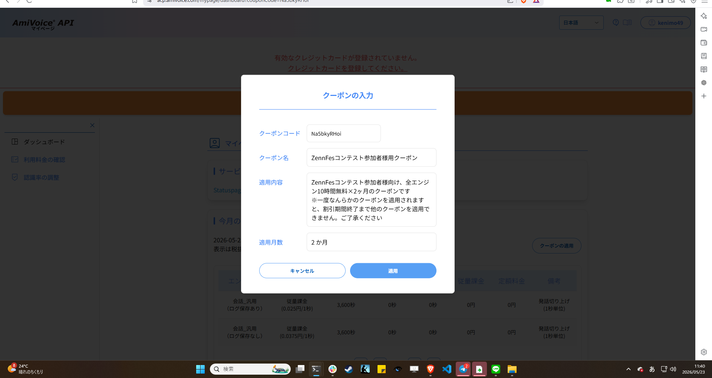
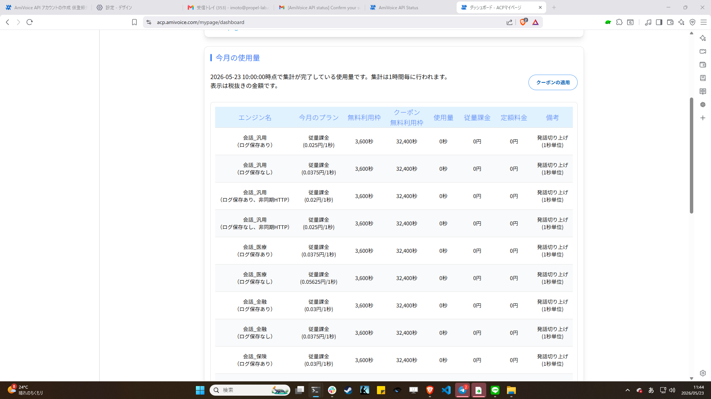

# AmiVoice API Key 取得ガイド

> **対象:** speech-habit-lens を初めて動かす人
> **所要時間:** 約15分（クレジットカード登録含む）
> **費用:** 無料（月60分の無料枠内で運用する想定。Zennfes 期間中は月10時間枠）

このガイドは [AmiVoice Cloud Platform](https://acp.amivoice.com/main/) のアカウント登録から、API キーを取得して `.env` に設定し、`curl` で疎通確認するまでを通しで案内します。

---

## 1. 前提

| 必要なもの | 用途 |
|---|---|
| メールアドレス | アカウント登録・認証メール受信用 |
| クレジットカード | **必須**。未登録だと API キー発行画面（接続情報セクション）が表示されない |

> **クレジットカード必須の補足**: ACP のマイページは、クレジットカード未登録の状態だと「接続情報」セクション（APIキー発行UI）自体が表示されない。無料枠／クーポン枠の範囲で使う限り課金は発生しないが、登録だけは必要。デビット／プリペイドカードでも可。

**無料枠について（重要）**

- **全エンジン共通で月60分（3,600秒）まで無料**（エンジンごとに60分ずつ加算ではなく、合計60分）
- ESAS（感情分析）も無料枠の対象
- 超過すると `¥79.2/時間〜` の従量課金
- speech-habit-lens は1解析≒1分なので、**月60本まで実質無料**で運用できる

### Zennfes 2026 春 — Trial クーポン（2026年5月・6月限定）

Zennfes 2026 春のスポンサー枠（株式会社アドバンスト・メディア）で、**全エンジン10時間無料 × 2ヶ月**の Trial クーポンが配布されている。speech-habit-lens の開発期間（2026-05〜06）はこちらを使えば、無料枠を気にせず実装と検証が可能。

- クーポンコード: `Na5bkyRHoi`
- クーポン名: `ZennFesコンテスト参加者様用クーポン`（適用画面で表示される正式名）
- 適用内容: 全エンジン10時間無料 × 2ヶ月
- 適用先: AmiVoice API（ESAS 含む）
- 期間: 2026年5月・6月
- 適用方法: アカウント登録後、**マイページTOP（ダッシュボード）右上の「クーポンの適用」ボタン**から入力（[手順詳細](#45-ステップ-35--zennfes-trial-クーポンを適用2026年56月のみ)）

> **クーポンの動作仕様（実測）**: 通常の月60分無料枠は据え置きで、クーポン分として**追加で540分（=32,400秒）**が各エンジンに付与される（無料60分 + クーポン540分 = 合計600分 = 10時間）。
>
> **注意**: 一度クーポンを適用すると、割引期間（2ヶ月）が終了するまで他のクーポンは適用できない。
>
> Zennfes 期間後（2026年7月以降）は通常の月60分無料枠に戻る。本ツールの設計（1解析≒1分）であれば通常運用も無料枠で収まる。
> このクーポンは Zennfes 参加者向けに公開されたコードのため、本リポジトリにも記載している。Zennfes 期間外に始める読者は AmiVoice 公式から通常登録すれば月60分の無料枠で動かせる。

---

## 2. ステップ 1 — アカウント登録

AmiVoice の登録は「**メールアドレスで仮登録 → 認証メールのリンクから本登録**」の2段構成。



### 2.1 仮登録（メールアドレスのみ）

1. [https://acp.amivoice.com/main/](https://acp.amivoice.com/main/) にアクセス
2. ページ中央のオレンジボタン **「APIを無料で利用開始」** をクリック（または上部ナビの「無料体験版申込」「音声認識API無料体験版」でも同じ画面に遷移）
3. 「AmiVoice API アカウントの作成」画面で **メールアドレスを入力 → 「同意する」にチェック → 送信**



### 2.2 認証メール

- 入力したメールアドレスに、AmiVoice 公式から認証メールが届く（迷惑メールフォルダに入る場合あり）
- メール本文中のリンクをクリック → 本登録画面に遷移
- リンクは有効期限つき（届いたら速やかにクリック推奨）

> **トラブル**: メールが届かない場合は、
> 1. 迷惑メールフォルダ確認
> 2. メールアドレスの打ち間違いがないか確認（仮登録画面でもう一度入力）
> 3. それでも届かない場合は AmiVoice 公式の[お問い合わせ](https://www.amivoice.com/contact/) から連絡

### 2.3 本登録（アカウント情報・支払い方法）

認証メールのリンクから本登録画面に遷移したら、以下を入力する。

| 項目 | 内容 |
|---|---|
| 希望アカウントID | 半角英数 3〜14文字 |
| パスワード | 半角英数記号 6〜20文字（強度メーター付き） |
| パスワード確認 | 同じパスワードを再入力 |
| アカウント所有者 姓名 | 必須 |
| アカウント所有者 電話番号 | 必須 |
| 住所 | 必須 |
| 支払い方法 | クレジットカード払い または 請求書払い（後で「接続情報」を使うためには**クレジットカード登録が事実上必須**） |

登録完了後、自動でマイページにログインする（ログインIDは仮登録メールアドレスではなく、本登録で決めた「希望アカウントID」を使う）。

---

## 3. ステップ 2 — マイページにログイン

1. [https://acp.amivoice.com/mypage/](https://acp.amivoice.com/mypage/) からログイン（本登録で決めたアカウントIDとパスワード）
2. ダッシュボード（マイページTOP）が開く
3. APIキーは**左サイドバーには独立メニューがなく**、「ダッシュボード」ページの下部にある **「接続情報」セクション**で扱う（詳細はステップ 3）



### マイページのサイドバー構成

| メニュー | 用途 |
|---|---|
| ダッシュボード | 今月の使用量、サービス稼働状況、**接続情報（APIキー発行）**、クーポン適用 |
| 利用料金の確認 | 月別の課金状況・請求情報 |
| 認識率の調整 | カスタムボキャブラリなど、認識精度のチューニング |

> **重要**: クレジットカード未登録の状態では「接続情報」セクションが非表示。先にカード登録を済ませること。

---

## 4. ステップ 3 — API キーを発行

### 4.1 前提: クレジットカード登録

「接続情報」セクションは**カード登録後にのみ表示される**。マイページ上部に「有効なクレジットカードが登録されていません。クレジットカードを登録してください。」と赤字警告が出ている場合は、リンクからカード登録を済ませる。デビット／プリペイドでも可。

### 4.2 接続情報セクションを開く

1. マイページTOP（ダッシュボード）を下にスクロール
2. **「接続情報」**セクションが表示される
3. 緑色の **「APIキーの発行」** ボタンをクリック（アカウント作成直後に自動で1個発行されている場合もあるので、そのまま使ってもよい）
4. テーブルに新しいAPIキー行が追加される。APIキー列の **「表示」** リンクをクリックして実キーを表示・コピー



### 4.3 APIキーの形式

- 64〜70桁の英大文字 + 数字（例: `038088A0D0082F09...`）
- **このキーは秘密情報。第三者に公開しない、Git にコミットしない**
- 漏洩疑いがある場合は同じ画面の「削除」ボタンで失効 → 新規発行でローテーション

### サービスURL（2系統あるので注意）

接続情報セクションに表示されるサービスURLは **同期エンジン用**:

```
https://acp-api.amivoice.com/v1/nolog/
```

speech-habit-lens は録音済みファイルを送る **非同期エンジン**を使うため、エンドポイントは以下:

```
https://acp-api-async.amivoice.com/v1/recognitions
```

APIキーは両方のエンドポイントで共通。詳細は [API Reference](../knowledge/amivoice-api-reference.md) 参照。

### One-time APPKEY について

ACP では使い捨て用の APPKEY も発行できる（`Issuance of one-time APPKEY`）。
本ツールは常時稼働ではないので、**通常の APPKEY で十分**。

### ESAS の有効化

ESAS は **UI 側での個別 ON/OFF 設定は不要**。APIリクエスト時の `d` パラメータに `sentimentAnalysis=True` を含めるだけで有効になる（[ステップ 5](#6-ステップ-5--curl-で疎通確認) 参照）。

- 月60分の無料枠は ESAS にも適用される
- Zennfes クーポン適用中は ESAS も10時間枠で使える

---

## 4.5 ステップ 3.5 — Zennfes Trial クーポンを適用（2026年5・6月のみ）

> このセクションは Zennfes 2026 春の参加者向け。通常運用なら飛ばして良い。

1. マイページTOP（ダッシュボード）の **「今月の使用量」テーブル右上の青いボタン「クーポンの適用」** をクリック
2. クーポン入力モーダルが開くので、クーポンコード `Na5bkyRHoi` を入力
3. クーポン名「**ZennFesコンテスト参加者様用クーポン**」と適用内容「全エンジン10時間無料×2ヶ月」が表示されるのを確認
4. 青い **「適用」** ボタンを押す



### 適用後の確認

ダッシュボードの「今月の使用量」テーブルで、各エンジン行の **「クーポン残利用枠」列**に `32,400秒` （= 9時間 = 540分）と表示される。これと通常の **「無料利用枠」3,600秒**（= 60分）を合わせて **合計 36,000秒 = 10時間** が今月の無料枠になる。



> **注意**: 一度クーポンを適用すると、割引期間（2ヶ月）が終了するまで他のクーポンは適用できない。

---

## 5. ステップ 4 — `.env` に書く

リポジトリのルートで `.env.example` をコピーして `.env` を作成:

```bash
cd /path/to/speech-habit-lens
cp .env.example .env
```

エディタで `.env` を開いて、取得した APPKEY を書き込む:

```bash
AMIVOICE_API_KEY=ここに取得したAPPKEYを貼る
ANTHROPIC_API_KEY=後で設定（Claude 用、別途必要）
```

> **注意:** `.env` は `.gitignore` 済み。誤って `git add` しないこと。

---

## 6. ステップ 5 — `curl` で疎通確認

API キーが正しく機能するかを、サンプル音声を投げて確認する。

### 6.1 サンプル音声を用意

手元に短い `.wav`（10〜30秒、16kHz/16bit/mono 推奨）がなければ、`examples/sample.wav` を使う（ない場合は後述のコマンドで生成）。

### 6.2 ジョブを submit

```bash
source .env
curl -X POST https://acp-api-async.amivoice.com/v1/recognitions \
  -F "u=$AMIVOICE_API_KEY" \
  -F "d=grammarFileNames=-a-general sentimentAnalysis=True" \
  -F "a=@examples/sample.wav"
```

レスポンス例:

```json
{"sessionid": "01234567-89ab-cdef-0123-456789abcdef", "text": null}
```

`sessionid` をメモする。

### 6.3 結果を取得

数秒待ってから:

```bash
curl https://acp-api-async.amivoice.com/v1/recognitions/$SESSION_ID \
  -H "Authorization: Bearer $AMIVOICE_API_KEY"
```

`status` が `completed` になったレスポンスに、認識テキストと ESAS 結果が入っている。

### 6.4 動作確認できたら

- 認識テキストが返れば API キーは有効
- `sentiment_analysis` フィールドに 20 パラメータの時系列が入っていれば ESAS も有効

---

## 7. トラブルシュート

| 現象 | 原因 | 対処 |
|---|---|---|
| `code: "-"` が返る | APPKEY が無効 | マイページで APPKEY を再確認、`.env` のスペース混入チェック |
| `code: "+"` が返る | 音声フォーマット非対応 | WAV の PCM 16bit/mono/16kHz に変換 |
| 401 Unauthorized | GET の Bearer ヘッダが間違い | `Authorization: Bearer ` の後にキーをそのまま貼る（プレフィックス不要） |
| ESAS フィールドが空 | `sentimentAnalysis=True` が抜けている、または音量が極端に小さい | `d` パラメータを確認、音声の音量チェック |
| 月60分超過の通知 | 無料枠超過 | マイページで利用量確認、必要なら課金設定 |

---

## 8. 利用量のモニタリング

- マイページTOP（ダッシュボード）の **「今月の使用量」テーブル**で、エンジンごとの「使用量（秒）」「クーポン残利用枠」「従量課金」「定期料金」を確認できる
- より詳しい月別の集計は **左サイドバー「利用料金の確認」**ページ
- 集計には最大1時間のラグがある（テーブル上部に「N時00分時点で集計が完了している使用量です」と表示）
- speech-habit-lens 自体には利用量カウント機能はない（v0.2 で検討）
- 月の上限が近づいたら手動で運用を絞る

---

## 9. 関連リンク

- [AmiVoice Cloud Platform](https://acp.amivoice.com/main/) — 公式トップ
- [API マニュアル](https://docs.amivoice.com/) — 完全リファレンス
- [ESAS サービス](https://acp.amivoice.com/main/service/esas/) — 感情分析の解説
- [料金ページ](https://acp.amivoice.com/main/charge/) — 課金体系

### 本リポジトリの関連ドキュメント

- [Overview](../knowledge/amivoice-overview.md) — AmiVoice サービス全体像
- [API Reference](../knowledge/amivoice-api-reference.md) — 3インタフェースの詳細
- [ESAS 20パラメータ](../knowledge/amivoice-esas.md) — 感情分析の完全リファレンス
